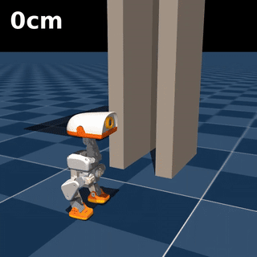

# Chimney climbing

[Full video](media/preview.mp4) ·
[Policies and checkpoints](https://huggingface.co/HannesVonEssen/microduck-chimney-climb) ·
[Simulation, training tasks and policy contracts](../../docs/chimney-climb.md)

Training continuation: [main climb](../../docs/chimney-training.md) ·
[enter and exit](../../docs/chimney-companion-training.md).

Microduck braces between walls 12.5 cm apart, climbs to a 3 m platform,
exits, then uses Pollen Robotics' official get-up policy to stand.
The main released policy is the climb, with enter and exit companions.

This is a selected successful simulation sequence, not hardware validation or
a robust full-chain success claim. See the linked documentation and HF
evaluation records for the reproduction limitations and exact handoffs.

The animated preview shows the complete final video at its original playback
speed, reduced to 320×320 and 12 FPS for the README. The full MP4 is unchanged.
