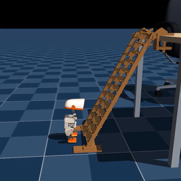

# Climbing

Microduck climbs an alternating-tread ladder, lands on the desk, and gets back onto its feet.

[Models and full training checkpoints](https://huggingface.co/HannesVonEssen/microduck-climb) · [Ladder, mounts and generators](../../hardware/ladder/README.md) · [Continue training](TRAINING.md)

## Two policies, one sequence

| Model | Role | Checkpoint |
|---|---|---|
| `climber.onnx` | Climb the ladder and reach the desktop | height-gate control, iteration 56500 |
| `getup.onnx` | Recover and stand on the table | warm get-up control, 128 updates |

Both actors consume the usual **61-dimensional observation**, with all 13 command slots exactly zero. Their normalizers are baked into the ONNX graphs. Full actor, critic and Adam checkpoints are included on Hugging Face. The get-up learner originally used the official standing actor with a newly initialized critic and optimizer; the supplied warm checkpoint contains its subsequently trained optimizer state.

**The switch is currently simulator-only.** It requires direct foot–desktop contact and the root at least 4 cm inside the table edge. Neither actor receives that information, but the supervisor does. Loading the ONNX pair into the robot alone does not implement this detector.

An onboard alternative is to use IMU-based fall detection to switch into get-up recovery. The [upstream Microduck runtime](https://github.com/pollen-robotics/microduck/blob/e9cca6272f633dd9054dd0e021f356fe086e5be1/docs/design/robotd-design.md#241-falling-is-a-third-event) already enables a fall-response sequence by default during ordinary driving, eventually returning control to the standing policy. Reusing that machinery should make a fall-triggered switch straightforward to implement. It is not yet wired into this climbing skill: the existing reflex is disabled during active skills, so the handoff and its thresholds still need integration and testing for climbing. No hardware validation is claimed.

See [the runtime contract](RUNTIME.md) for gain, filter and previous-action conventions. The climber stays unfiltered; the get-up model uses its matched recovery filters. Changing either convention changes the policy behavior.

## Reproduce and inspect

The `source/` directory preserves the environment implementation and dependency lock. `training/` contains the geometry patches and runnable continuation/evaluation entry points. `evidence/` records checkpoint hashes, the selected run, handoff details and the wider fresh validation battery. The full recording arrays are in [`recording/`](recording/), losslessly compressed with their original and packaged hashes in `recording/provenance.json`.

The desk is **1.4 × 0.8 m**, with its top at **0.66 m**. The retained ladder has **27 treads**, an integrated central spine, a curved upper section and corrected edge clamps. Render and collision table dimensions agree. Failure flags remain recorded while physics and recovery continue; the robot is never reset out of a fall in the video.
