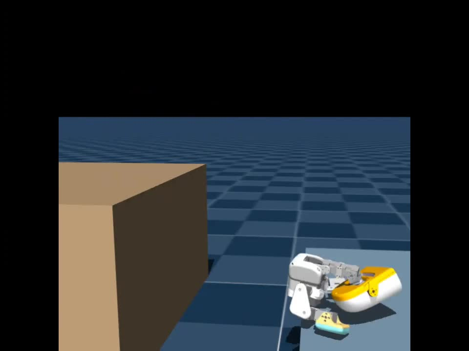
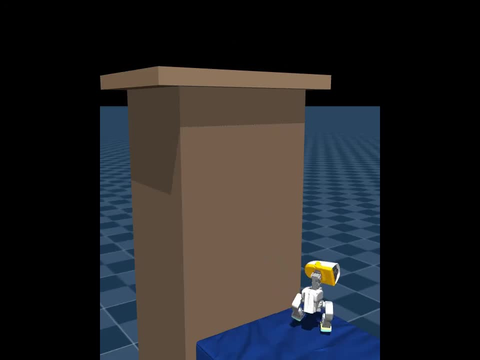

# Raised-platform jump and backflip

Two experimental simulation policies, released separately from the still-unreleased descending-pillar policy.

| Skill | Preview | Policy and details |
| --- | --- | --- |
| Long jump | [](media/long-jump.mp4) | [HF](https://huggingface.co/HannesVonEssen/microduck-long-jump) · [Details](long-jump/README.md) |
| Backflip | [](media/backflip.mp4) | [HF](https://huggingface.co/HannesVonEssen/microduck-backflip) · [Details](backflip/README.md) |

**Simulation only; hardware unvalidated. Landings may damage or break the real robot.** The backflip uses an uncalibrated soft-contact mat, not a rigid floor. It can recover to standing but subsequently drift off the mat; it is not a stable idle policy.

## Reproduce

Download the trusted `checkpoint.pt` from the respective HF repo. Install system EGL/OpenGL or OSMesa for headless rendering, then:

```bash
uv sync --locked
uv run python scripts/parkour_release.py long-jump render --checkpoint /path/to/long-jump/checkpoint.pt --output eval/long-jump.mp4
uv run python scripts/parkour_release.py backflip render --checkpoint /path/to/backflip/checkpoint.pt --output eval/backflip.mp4
```

A CUDA GPU is recommended. Set `MUJOCO_GL=egl` or `MUJOCO_GL=osmesa` for the installed rendering backend. Each command runs one fresh episode, seed 28, stopping at its first termination. For checkpoint continuation use [TRAINING.md](TRAINING.md), not the render settings.

Both actors use 61 observations, 14 bounded joint-position actions and 50 Hz control. ONNX includes normalization and action bounds. Course/drop commands and joint offsets must match each HF `config.json`; these are not drop-in walking policies and have no vision.

## Evidence and provenance

The previews are excerpts from the author's research compilation. Exact original per-cut checkpoint/seed mapping is unverified; they are not promised seeded replays. The packaged p1 checkpoint is iteration 15,250 and f21 is iteration 12,000. Fresh renders of these exact checkpoints demonstrate the jump and backflip, with the qualifications in [VERIFICATION.md](VERIFICATION.md). No success-rate or hardware-safety claim follows from a selected take or a training smoke test.

Only the two released behaviors, their shared long-jump foundation, stages, render profiles, continuation recipes and tests are included here. Descending-pillar source/policy publication remains deferred.
