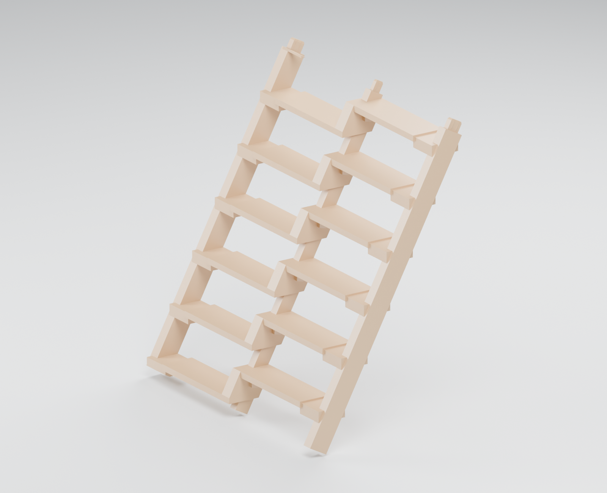
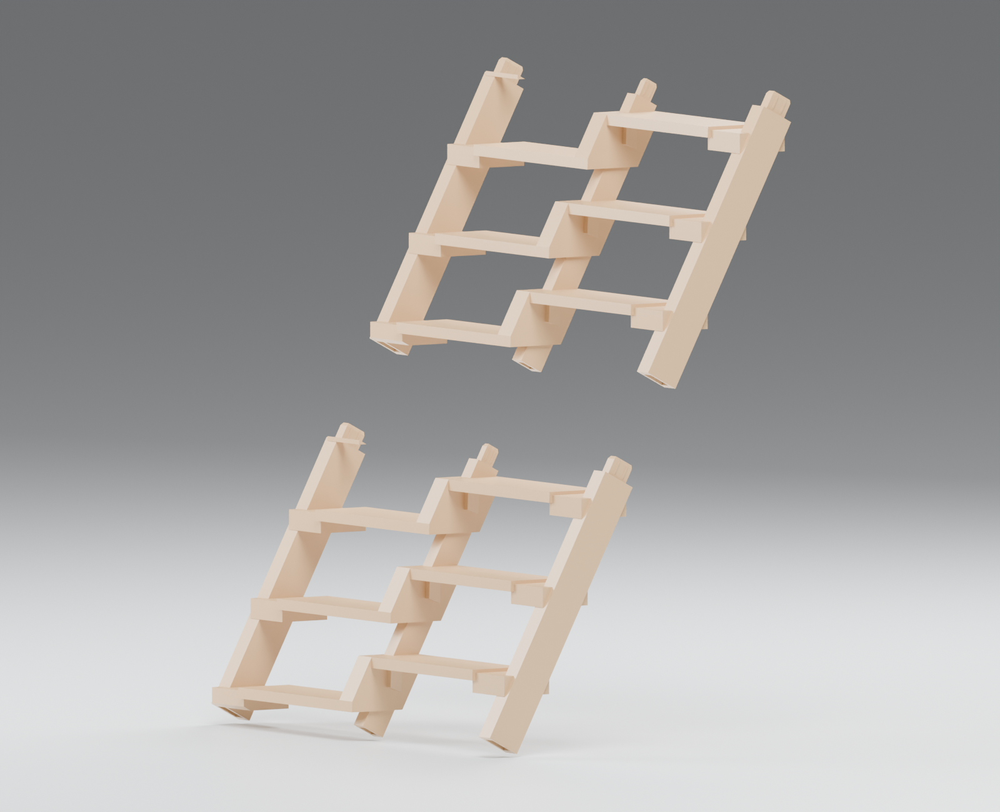
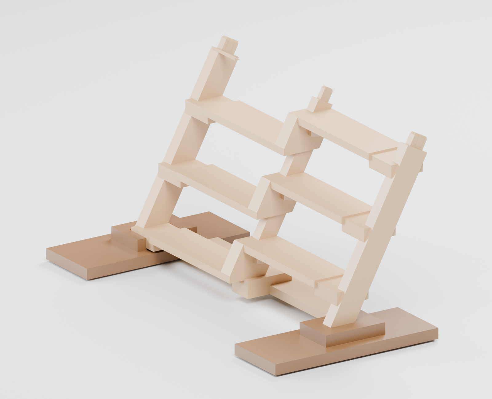
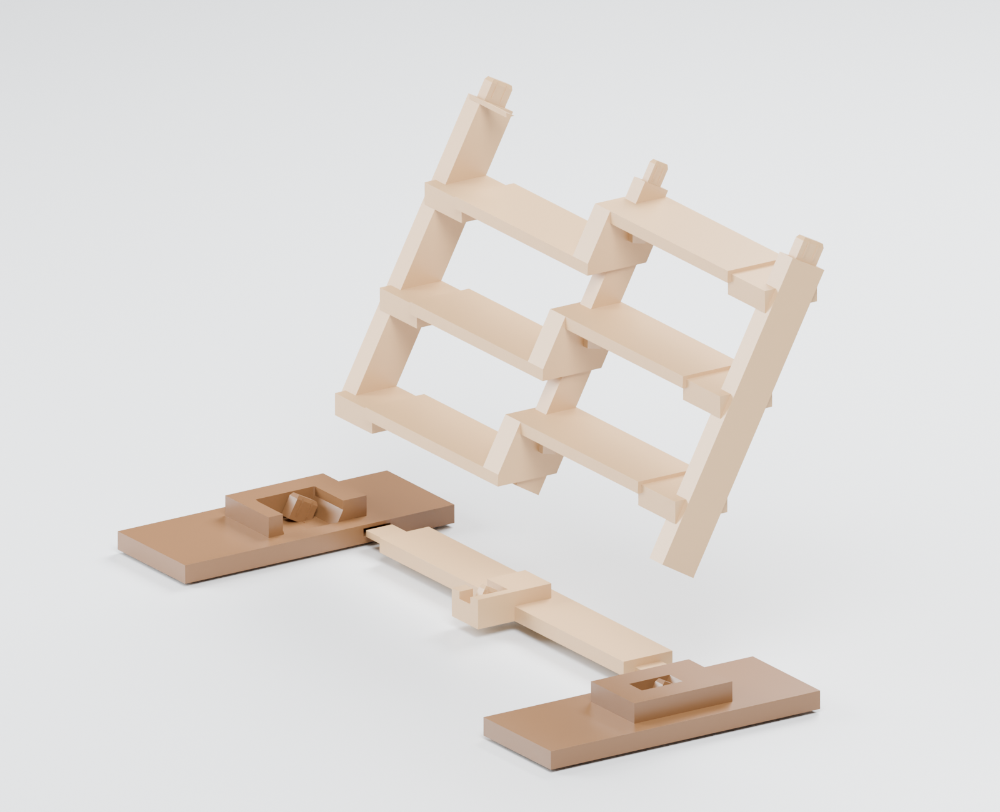
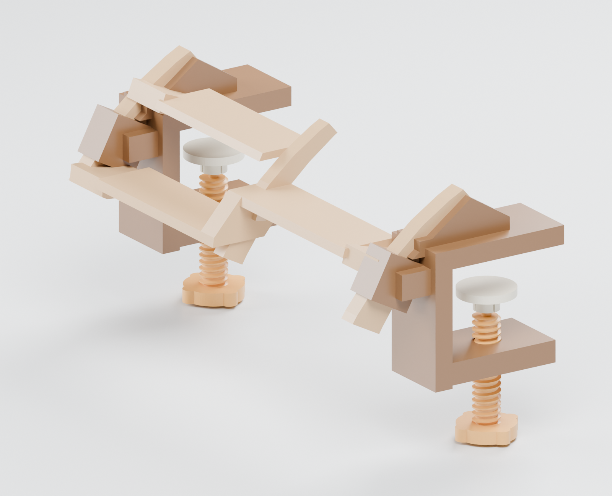
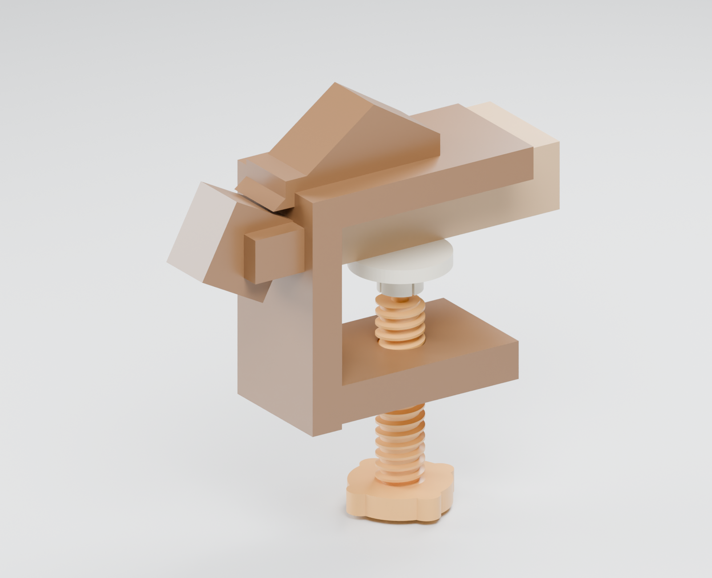
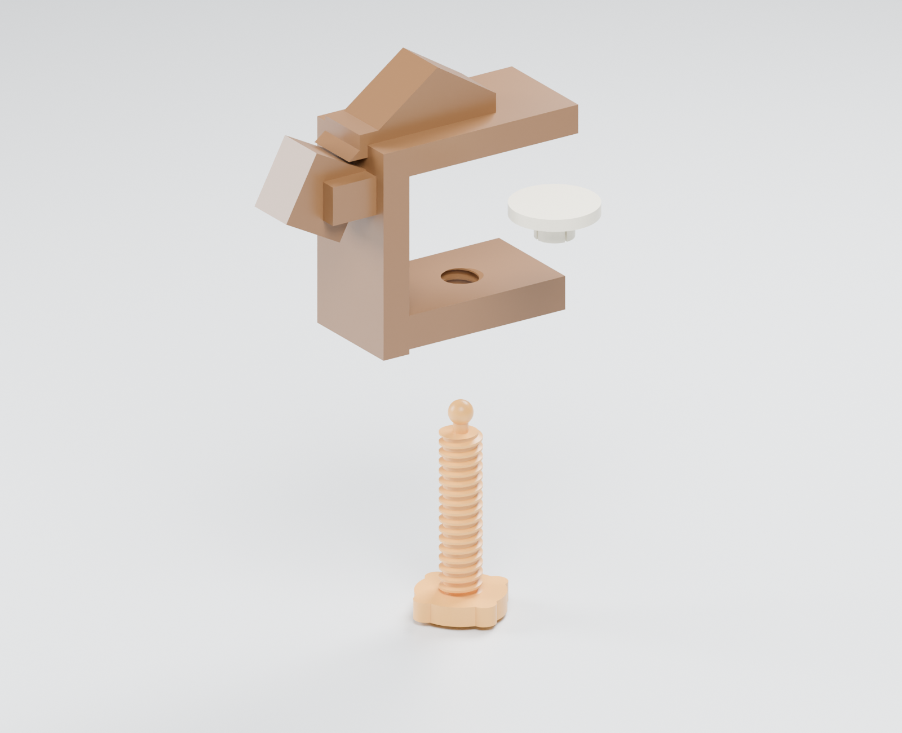

# Modular ladder for a desk

The current design is **pin-free**. Integrated rail-end tenons slide into matching sockets in the next module. Narrow friction ribs provide the snug fit; broad end shoulders seat the modules. There are no securing pins, pin holes or internal locking pockets. The floor base uses the same friction-fit docking joints. All 27 evaluated treads remain whole and at their original positions.

| Joined modules | Exploded friction-fit joints |
|---|---|
|  |  |

Align all three tenons, then slide the module along the rails until the shoulders meet. Pull along the same direction to separate it. The central spine and both side rails have chamfered lead-ins. Friction supplies retention; this is not a positive lock and no pull-out force has been measured.

| Floor base assembled | Floor base exploded |
|---|---|
|  |  |

Slide the crossbar tongues into the shoes, then dock the three ladder rails onto their tenons. The fixed spacing of the docked rails captures the crossbar between the shoes. The floor base is freestanding; it does not clamp to the floor.

## Choose the friction fit with coupons

The tenon body has 0.30 mm running clearance per face. Four narrow ribs take up that clearance; the default rib tips extend **0.05 mm per face** beyond the nominal socket wall. This is a small intentional interference, not a geometry error or a verified printer tolerance. The tip is chamfered and the ribs ramp in gradually.

Print the side and spine socket coupons plus their matching tenon variants:

| Filename number | Nominal rib interference per face |
|---|---:|
| `000` | 0.000 mm |
| `025` | 0.025 mm |
| `050` (default) | 0.050 mm |
| `100` | 0.100 mm |

Files are `coupon-side-XXX-tenon.stl`, `coupon-spine-XXX-tenon.stl`, `coupon-side-socket.stl` and `coupon-spine-socket.stl`. Keep the variants labelled after printing. Start loose and choose the smallest interference that slides together firmly by hand. If it binds, do not force the complete module. Printer calibration, material, surface finish and repeated assembly all affect retention. A small coupon cannot predict the force of three simultaneous full-size joints, so test one module connection before building the full ladder.

Regenerate all mating parts with the selected value, for example:

```bash
FRICTION_INTERFERENCE_MM=0.025 python friction_fit.py
```

Use the same value for the ladder modules and floor docking. No hardware has been physically printed or tested for this update.

## Final module and table mounts



Only the last module and its two complete table mounts are shown here, including the printed tightening screws and pressure pads.

## Threaded table clamp

| Clamp with tabletop cut away | Screw and pressure pad exploded |
|---|---|
|  |  |

The clamp retains its printed screw, matching female jaw thread and snap-on swivelling pressure pad. The right-handed screw has 4 mm pitch, 17 mm major diameter and 13.6 mm root diameter, with 14 mm of jaw engagement. Its designed tabletop range is 15–40 mm; 25 mm is shown. Insert the screw from below and snap the pad onto its tip inside the jaw. Test the thread and snap fit on your material before use. The common clamp meshes are under `clamps/`, and are included with both module sizes.

## Print files and assembly

- **`friction-fit/`**: four six-tread modules and one three-tread curved top, numbered `module-01` through `module-05` from the floor upwards.
- **`friction-fit-3step/`**: nine three-tread modules, numbered `module-01` through `module-09`.
- Choose one segmentation. Add `floor--143.stl`, `floor-0.stl`, `floor-143.stl`, both `clamp-body-*.stl` parts, two `clamp-screw.stl` and two `pressure-pad.stl`. No pins are needed.
- The straight middle sections can repeat. A six-tread repeat rises approximately 154.94 mm and advances 82.38 mm. The floor and curved top modules are specialized; move the curved end and table mount together when changing the length. A changed setup needs its own robot evaluation.

STL units are **millimetres**. Ordinary files are translated to the origin. `-assembly.stl` files retain world coordinates and are inspection duplicates, not extra print parts. `-bed-oriented.stl` files rotate the modules and crossbar for packing. Both segmentations fit geometrically in a 256 mm cube in the supplied orientations; **supports, adhesion margins and machine exclusions still need slicing checks**. Packing orientation does not establish mechanical strength or support efficiency.

Print the screw with the knob down and thread axis vertical. Keep support material out of sockets and threads where possible. Inspect sliced toolpaths and layer orientation; tune the coupon fit before printing complete modules.

## Generators and verification

```bash
python -m pip install numpy scipy trimesh manifold3d
python generate_clamps.py                  # current threaded clamp, screw and pad
python friction_fit.py                     # default 0.05 mm rib interference
python friction_fit.py --treads-per-module 3
python orient_prints.py --directory friction-fit
python orient_prints.py --directory friction-fit-3step
python validate_friction.py
blender -b --python render_friction.py       # current ladder Cycles renders
blender -b --python render_clamps.py         # current clamp Cycles renders
```

Checks cover watertight single-solid manufacturing parts, complete tread preservation, packing, clamp identity and sampled docking paths. They explicitly distinguish intended rib interference from unintended collisions. **Rigid mesh overlap does not predict insertion force, wear or retention.** See [VALIDATION.md](VALIDATION.md).

Cycles renders import the same exported assembly STLs. `.blend` files and the assembled GLB are included. The policies and evaluated scene remain unchanged; robot clearance around redesigned hardware still needs validation.

Both `friction-fit/` and `friction-fit-3step/` use the same current design; they differ only in module length. This package contains no superseded connector designs or concept meshes. `evaluated-geometry.json` is the source reference for the unchanged tread placement, not a second set of printable parts.

Hardware: [CC BY-NC-SA 4.0](../../LICENSE-HARDWARE). Generators: [Apache 2.0](../../LICENSE). Robot design: Pollen Robotics; see NOTICE and attribution.
